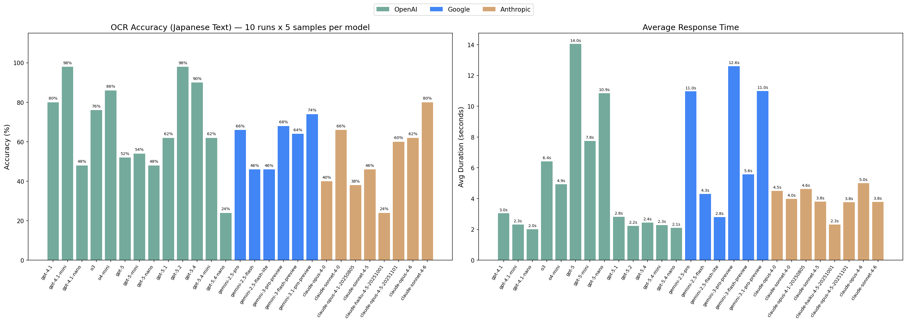

## LLM OCR benchmark

It's interesting to try different models on things that they fail on to see which ones fail.

I've got this image () which gpt-5 had a low success rate on OCRing, and so I've tested it against various models.

Note: copyright steins;gate I guess? This isn't a substitute for the visual novel, so I'm hoping it's fair use.

### Task

Each model is given `sample.jpg` (an image containing Japanese text) and asked:

> "Please output your best guess at the Japanese characters in this image. Do not output any other text."

The correct answer is: `一度言ってしまったら、もう後には退けなかった。`

For some reason, gpt-5 models like to output `引` instead of `退`.

Each model was run 10 times. An answer is "correct" only if it matches the expected string exactly.

## Results

I picked a grab-bag of recent models.



| Model | Accuracy | Avg Time |
|-------|----------|----------|
| gpt-4.1 | 100% | 2.5s |
| gpt-4.1-mini | 100% | 2.1s |
| gpt-4.1-nano | 100% | 1.8s |
| o3 | 100% | 3.2s |
| o4-mini | 100% | 3.1s |
| gpt-5 | 40% | 10.9s |
| gpt-5-mini | 0% | 9.2s |
| gpt-5-nano | 20% | 8.2s |
| gpt-5.1 | 100% | 2.3s |
| gpt-5.2 | 100% | 1.9s |
| gpt-5.4 | 100% | 1.8s |
| gpt-5.4-mini | 60% | 1.7s |
| gpt-5.4-nano | 100% | 1.5s |
| gemini-2.5-pro | 100% | 10.7s |
| gemini-2.5-flash | 90% | 4.8s |
| gemini-2.5-flash-lite | 100% | 2.4s |
| gemini-3-pro-preview | 100% | 10.9s |
| gemini-3-flash-preview | 100% | 4.2s |
| gemini-3.1-pro-preview | 100% | 10.4s |
| claude-opus-4.0 | 100% | 4.0s |
| claude-sonnet-4.0 | 100% | 3.3s |
| claude-opus-4.1 | 100% | 3.6s |
| claude-sonnet-4.5 | 100% | 4.0s |
| claude-haiku-4.5 | 100% | 2.1s |
| claude-opus-4.5 | 100% | 2.9s |
| claude-opus-4.6 | 100% | 3.6s |
| claude-sonnet-4.6 | 100% | 3.0s |

## Raw Data

See [results.csv](results.csv) for full per-run data.

## Reproduction

```bash
bash benchmark.sh
nix-shell -p python3Packages.matplotlib python3Packages.numpy --run "python3 graph.py"
```
